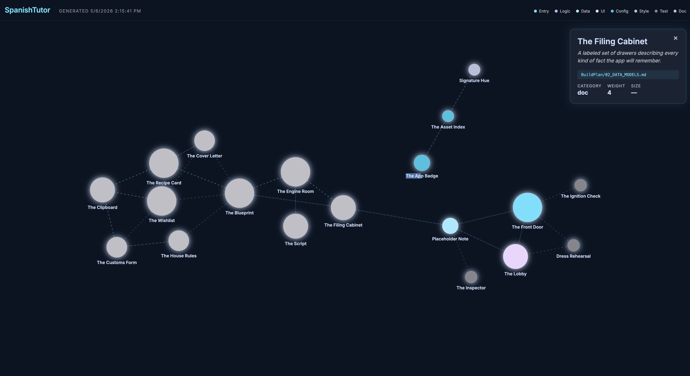

# Neural Map

> Visualize your Claude Code project as a navigable concept map. Each file gets a simplified name and metaphor instead of raw filenames.



AI-assisted projects produce more code than you can hold a mental model of. Neural Map captures your most recently-touched project files and labels each with a 2–4 word concept name and a one-sentence metaphor — so `scripts/scan.js` becomes "The Census Taker — walks every room of the house, writes down who lives where and how recently they moved in."

It's a Claude Code plugin. The same model that's writing your code does the labeling.

## Demo


## Install

```
/plugin marketplace add alexschar/neural-map
/plugin install neural-map@alexschar
/reload-plugins
```

## Use

In any project:

```
/neural-map:neural-map
```

Claude scans the most-recently-modified files in your project, generates concept names and metaphors for each, writes the result to `.claude/neural-map/state.json`, and opens the visualization in your browser.

## What you get

- A force-directed graph of your project, color-coded by category (Entry, Logic, Data, UI, Config, Style, Test, Doc)
- Each node sized by how central the file is to the project
- Click any node for the filepath, full metaphor, and stats
- A self-contained HTML file written to `.claude/neural-map/index.html` — share it, archive it, version it

## Example output

Run on this repo (a small Claude Code plugin), Neural Map produced:

| File | Concept name | Metaphor |
|---|---|---|
| `commands/neural-map.md` | The Director's Notes | The script the director hands the cast — every cue, every scene, in order. |
| `scripts/scan.js` | The Census Taker | Walks every room of the house, writes down who lives where and how recently they moved in. |
| `viewer/template.html` | The Display Case | The empty glass case the museum drops the day's exhibit into. |
| `.claude-plugin/marketplace.json` | The Storefront Sign | The sign hung above the shop door so passersby know what's sold inside. |
| `.gitignore` | The Do-Not-Pack List | The note on the fridge listing what not to bring on the trip. |
| `LICENSE` | The Permission Slip | The signed permission slip from school — what kids are and aren't allowed to do. |

## What this is not (yet)

- ❌ Real-time updates (re-run `/neural-map:neural-map` to refresh)
- ❌ Drag-to-connect node editing
- ❌ Editable concept names from the viewer
- ❌ Multi-project workspace view

These are on the roadmap. See [issues](https://github.com/alexschar/neural-map/issues) for status, or open a feature request.

## How it works

The plugin is a single slash command that:

1. Runs a zero-dependency Node scanner to list the 30 most-recently-modified text files
2. Asks the running Claude Code session to generate `{ conceptName, metaphor, category, weight, connections }` for each
3. Writes the result to `.claude/neural-map/state.json` (merging with any existing state)
4. Renders a self-contained HTML file with the state inlined and opens it in your default browser

No external API key. No build step. No dependencies.

## Requirements

- Claude Code v2.1.131 or later
- Node.js (any recent version — the scanner uses zero npm dependencies)
- macOS (the viewer-open step uses `open`; cross-platform support tracked in [#1](https://github.com/alexschar/neural-map/issues/1))

## License

MIT. See [LICENSE](LICENSE).

## About

Built by [Alex Schar](https://alexschar.dev) — AI Systems Engineer in Dallas, TX.
