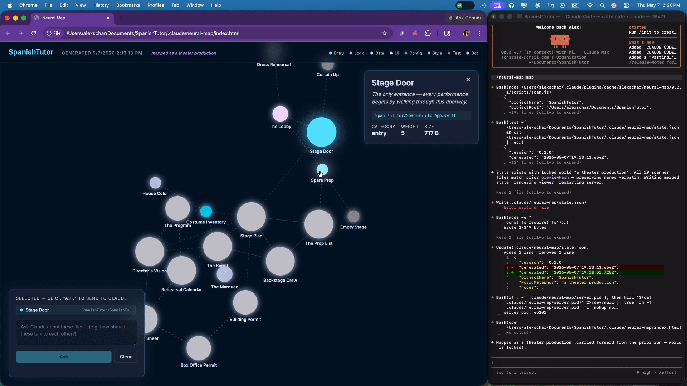

# Neural Map

> Your project becomes a place you can walk through. Every file is a room, a door, or a piece of wiring — all belonging to one coherent world.



AI-assisted projects produce more code than you can hold a mental model of. Neural Map captures the files you're actively working on and labels each one as a part of a single, universal metaphor — not a random pile of clever names.

If your project is a house: `auth.ts` is the doorman, `db/schema.sql` is the foundation, `theme.css` is the lighting. If it's a car: `main.tsx` is the ignition, `middleware/` is the dashboard, `tests/` is the test drive. The plugin picks the world. You walk through it.

## Demo


## Install

```
/plugin marketplace add alexschar/neural-map
/plugin install neural-map
/reload-plugins
```

## Use

In any project:

```
/neural-map:map
```

Claude scans the most-recently-modified files in your project, picks one universal world that fits the project's shape (a house, a car, a kitchen, a garden, a workshop...), names every file as a role within that world, and opens the visualization in your browser.

The world is locked the first time. Re-runs preserve names of files that haven't materially changed — your "front door" stays the front door across sessions.

## Talk to the map

Click any node — or shift-click for several — to select. Type a question in the composer panel, click Ask. Then in your terminal, type any prompt (e.g. "go") and press Enter. Your next prompt arrives in Claude with the selected files and your question already in context.

This is the actual feature: your visualization isn't a passive picture. It's a remote control for your conversation.

## What you get

- A force-directed graph of your project under one universal metaphor
- Concept names that bridge metaphor and function — *"The doorman of your app — checks every visitor's keys before letting them past the foyer."*
- Each node sized by how central the file is to the project, color-coded by category (Entry, Logic, Data, UI, Config, Style, Test, Doc)
- Click any node for the filepath, full metaphor, and stats
- Shift-click to multi-select; send the selection to your Claude Code session as context with one click
- A self-contained HTML file at `.claude/neural-map/index.html` — share it, archive it, version it

## Example: this repo, mapped as a workshop

| File | Concept name | Metaphor |
|---|---|---|
| `commands/map.md` | The Master Plan | The master plan of your plugin — every step the apprentice follows on the day's job. |
| `scripts/scan.js` | The Inventory Clerk | The inventory clerk of your plugin — walks the shelves and writes down what's in stock and how recently it moved. |
| `viewer/template.html` | The Display Window | The display window of your plugin — where today's finished work goes on view for visitors. |
| `scripts/writer-server.js` | The Carrier Pigeon | The carrier pigeon of your plugin — runs every message from the workshop floor up to the foreman's office. |
| `hooks/inject-pending.js` | The Foreman's Slip | The foreman's slip of your plugin — the note handed off to the next worker so they know what's just been asked. |
| `.claude-plugin/marketplace.json` | The Storefront Sign | The storefront sign of your plugin — what passersby read before deciding to step inside. |
| `LICENSE` | The Operating Permit | The operating permit of your plugin — the paperwork that says you're allowed to be in business. |

## What this is not (yet)

- ❌ Drag-to-connect node editing
- ❌ Editable concept names from the viewer
- ❌ Real-time sync as Claude edits files
- ❌ Multi-project workspace view

These are on the roadmap. See [issues](https://github.com/alexschar/neural-map/issues) for status, or open a feature request.

## How it works

1. A zero-dependency Node scanner lists the 30 most-recently-modified text files in the project
2. The slash command picks one universal world that fits the project's shape, then names every file as a role within that world
3. State is written to `.claude/neural-map/state.json`, merged with prior runs to keep names stable
4. A self-contained HTML viewer is rendered with state inlined and opened in your browser
5. A tiny localhost writer-server lets the canvas POST selections back to your Claude Code session via a `UserPromptSubmit` hook, so clicking nodes and asking questions injects directly into your next prompt

No external API key. No build step. No npm dependencies.

## Requirements

- Claude Code v2.1.131 or later
- Node.js (any recent version — the scanner uses zero npm dependencies)
- macOS (the viewer-open step uses `open`; cross-platform support tracked in [#1](https://github.com/alexschar/neural-map/issues/1))

## License

MIT. See [LICENSE](LICENSE).

## About

Built by [Alex Schar](https://alexschar.dev) — AI Systems Engineer in Dallas, TX.
